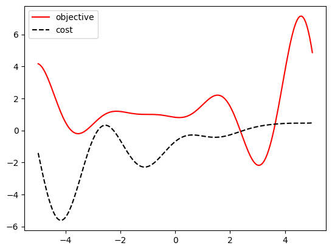

```python
import warnings

import botorch
import gpytorch
import matplotlib.pyplot as plt
import numpy as np
import torch
from tqdm.notebook import tqdm

from bo.objectives import forrester
from bo.train import fit_gp_model
```


```python
def objective(x):
    return forrester(x)


def cost(x):
    return -(0.1 * objective(x) + objective(x - 4)) / 3 + x / 3 - 0.5


lb = -5
ub = +5
bounds = torch.tensor([[lb], [ub]], dtype=torch.float)
xs = torch.linspace(lb, ub, 201)

objective_ys = objective(xs)
cost_ys = cost(xs)
```


```python
plt.plot(xs, objective_ys, label="objective", c="r")
plt.plot(xs, cost_ys, linestyle="--", label="cost", c="k")
plt.legend();
```


    

    


```python
class GPModel(gpytorch.models.ExactGP, botorch.models.gpytorch.GPyTorchModel):
    _num_outputs = 1

    def __init__(self, train_x, train_y, likelihood):
        super().__init__(train_x, train_y, likelihood)
        self.mean_module = gpytorch.means.ConstantMean()
        self.covar_module = gpytorch.kernels.ScaleKernel(
            gpytorch.kernels.MaternKernel(nu=2.5, ard_num_dims=1)
        )

    def forward(self, x):
        mean_x = self.mean_module(x)
        covar_x = self.covar_module(x)
        return gpytorch.distributions.MultivariateNormal(mean_x, covar_x)
```


```python
num_queries = 10
num_repeats = 10
```


```python
strategy = "ei"  # "cei" or "ei"
strategy = strategy.upper()

# -2 is the default value when no feasible has been found
default_value = -2
feasible_incumbents = torch.ones((num_repeats, num_queries)) * default_value

for trial in range(num_repeats):
    print("trial", trial)

    torch.manual_seed(trial)
    train_x = bounds[0] + (bounds[1] - bounds[0]) * torch.rand(1, 1)
    train_utility = objective(train_x)
    train_cost = cost(train_x)

    for i in tqdm(range(num_queries)):
        feasible_flag = (train_cost <= 0).any()

        if feasible_flag:
            feasible_incumbents[trial, i] = train_utility[train_cost <= 0].max()

        utility_likelihood = gpytorch.likelihoods.GaussianLikelihood()
        utility_model = GPModel(train_x, train_utility.squeeze(-1), utility_likelihood)
        utility_model.likelihood.noise = 1e-4
        fit_gp_model(utility_model, utility_likelihood, train_x, train_utility.squeeze(-1))

        cost_likelihood = gpytorch.likelihoods.GaussianLikelihood()
        cost_model = GPModel(train_x, train_cost.squeeze(-1), cost_likelihood)
        cost_model.likelihood.noise = 1e-4
        fit_gp_model(cost_model, cost_likelihood, train_x, train_cost.squeeze(-1))

        if feasible_flag:
            best_f = train_utility[train_cost <= 0].max()
        else:
            best_f = torch.tensor(default_value)

        if strategy == "EI":
            policy = botorch.acquisition.analytic.LogExpectedImprovement(
                model=utility_model, best_f=train_utility.max()
            )
        if strategy == "CEI":
            policy = botorch.acquisition.analytic.LogConstrainedExpectedImprovement(
                model=botorch.models.model_list_gp_regression.ModelListGP(
                    utility_model, cost_model
                ),
                best_f=best_f,
                objective_index=0,
                constraints={1: [None, 0]},
            )

        with warnings.catch_warnings():
            warnings.filterwarnings("ignore", category=RuntimeWarning)
            next_x, acq_val = botorch.optim.optimize_acqf(
                policy, bounds=bounds, q=1, num_restarts=40, raw_samples=100
            )

        next_utility = objective(next_x)
        next_cost = cost(next_x)

        train_x = torch.cat([train_x, next_x])
        train_utility = torch.cat([train_utility, next_utility])
        train_cost = torch.cat([train_cost, next_cost])
```

    trial 0


      0%|          | 0/10 [00:00<?, ?it/s]


      0%|          | 0/500 [00:00<?, ?it/s]


      0%|          | 0/500 [00:00<?, ?it/s]


      0%|          | 0/500 [00:00<?, ?it/s]


      0%|          | 0/500 [00:00<?, ?it/s]


      0%|          | 0/500 [00:00<?, ?it/s]


      0%|          | 0/500 [00:00<?, ?it/s]


      0%|          | 0/500 [00:00<?, ?it/s]


      0%|          | 0/500 [00:00<?, ?it/s]


      0%|          | 0/500 [00:00<?, ?it/s]


      0%|          | 0/500 [00:00<?, ?it/s]


      0%|          | 0/500 [00:00<?, ?it/s]


      0%|          | 0/500 [00:00<?, ?it/s]


      0%|          | 0/500 [00:00<?, ?it/s]


      0%|          | 0/500 [00:00<?, ?it/s]


      0%|          | 0/500 [00:00<?, ?it/s]


      0%|          | 0/500 [00:00<?, ?it/s]


      0%|          | 0/500 [00:00<?, ?it/s]


      0%|          | 0/500 [00:00<?, ?it/s]


      0%|          | 0/500 [00:00<?, ?it/s]


      0%|          | 0/500 [00:00<?, ?it/s]


    trial 1


      0%|          | 0/10 [00:00<?, ?it/s]


      0%|          | 0/500 [00:00<?, ?it/s]


      0%|          | 0/500 [00:00<?, ?it/s]


      0%|          | 0/500 [00:00<?, ?it/s]


      0%|          | 0/500 [00:00<?, ?it/s]


      0%|          | 0/500 [00:00<?, ?it/s]


      0%|          | 0/500 [00:00<?, ?it/s]


      0%|          | 0/500 [00:00<?, ?it/s]


      0%|          | 0/500 [00:00<?, ?it/s]


      0%|          | 0/500 [00:00<?, ?it/s]


      0%|          | 0/500 [00:00<?, ?it/s]


      0%|          | 0/500 [00:00<?, ?it/s]


      0%|          | 0/500 [00:00<?, ?it/s]


      0%|          | 0/500 [00:00<?, ?it/s]


      0%|          | 0/500 [00:00<?, ?it/s]


      0%|          | 0/500 [00:00<?, ?it/s]


      0%|          | 0/500 [00:00<?, ?it/s]


      0%|          | 0/500 [00:00<?, ?it/s]


      0%|          | 0/500 [00:00<?, ?it/s]


      0%|          | 0/500 [00:00<?, ?it/s]


      0%|          | 0/500 [00:00<?, ?it/s]


    trial 2


      0%|          | 0/10 [00:00<?, ?it/s]


      0%|          | 0/500 [00:00<?, ?it/s]


      0%|          | 0/500 [00:00<?, ?it/s]


      0%|          | 0/500 [00:00<?, ?it/s]


      0%|          | 0/500 [00:00<?, ?it/s]


      0%|          | 0/500 [00:00<?, ?it/s]


      0%|          | 0/500 [00:00<?, ?it/s]


      0%|          | 0/500 [00:00<?, ?it/s]


      0%|          | 0/500 [00:00<?, ?it/s]


      0%|          | 0/500 [00:00<?, ?it/s]


      0%|          | 0/500 [00:00<?, ?it/s]


      0%|          | 0/500 [00:00<?, ?it/s]


      0%|          | 0/500 [00:00<?, ?it/s]


      0%|          | 0/500 [00:00<?, ?it/s]


      0%|          | 0/500 [00:00<?, ?it/s]


      0%|          | 0/500 [00:00<?, ?it/s]


      0%|          | 0/500 [00:00<?, ?it/s]


      0%|          | 0/500 [00:00<?, ?it/s]


      0%|          | 0/500 [00:00<?, ?it/s]


      0%|          | 0/500 [00:00<?, ?it/s]


      0%|          | 0/500 [00:00<?, ?it/s]


    trial 3


      0%|          | 0/10 [00:00<?, ?it/s]


      0%|          | 0/500 [00:00<?, ?it/s]


      0%|          | 0/500 [00:00<?, ?it/s]


      0%|          | 0/500 [00:00<?, ?it/s]


      0%|          | 0/500 [00:00<?, ?it/s]


      0%|          | 0/500 [00:00<?, ?it/s]


      0%|          | 0/500 [00:00<?, ?it/s]


      0%|          | 0/500 [00:00<?, ?it/s]


      0%|          | 0/500 [00:00<?, ?it/s]


      0%|          | 0/500 [00:00<?, ?it/s]


      0%|          | 0/500 [00:00<?, ?it/s]


      0%|          | 0/500 [00:00<?, ?it/s]


      0%|          | 0/500 [00:00<?, ?it/s]


      0%|          | 0/500 [00:00<?, ?it/s]


      0%|          | 0/500 [00:00<?, ?it/s]


      0%|          | 0/500 [00:00<?, ?it/s]


      0%|          | 0/500 [00:00<?, ?it/s]


      0%|          | 0/500 [00:00<?, ?it/s]


      0%|          | 0/500 [00:00<?, ?it/s]


      0%|          | 0/500 [00:00<?, ?it/s]


      0%|          | 0/500 [00:00<?, ?it/s]


    trial 4


      0%|          | 0/10 [00:00<?, ?it/s]


      0%|          | 0/500 [00:00<?, ?it/s]


      0%|          | 0/500 [00:00<?, ?it/s]


      0%|          | 0/500 [00:00<?, ?it/s]


      0%|          | 0/500 [00:00<?, ?it/s]


      0%|          | 0/500 [00:00<?, ?it/s]


      0%|          | 0/500 [00:00<?, ?it/s]


      0%|          | 0/500 [00:00<?, ?it/s]


      0%|          | 0/500 [00:00<?, ?it/s]


      0%|          | 0/500 [00:00<?, ?it/s]


      0%|          | 0/500 [00:00<?, ?it/s]


      0%|          | 0/500 [00:00<?, ?it/s]


      0%|          | 0/500 [00:00<?, ?it/s]


      0%|          | 0/500 [00:00<?, ?it/s]


      0%|          | 0/500 [00:00<?, ?it/s]


      0%|          | 0/500 [00:00<?, ?it/s]


      0%|          | 0/500 [00:00<?, ?it/s]


      0%|          | 0/500 [00:00<?, ?it/s]


      0%|          | 0/500 [00:00<?, ?it/s]


      0%|          | 0/500 [00:00<?, ?it/s]


      0%|          | 0/500 [00:00<?, ?it/s]


    trial 5


      0%|          | 0/10 [00:00<?, ?it/s]


      0%|          | 0/500 [00:00<?, ?it/s]


      0%|          | 0/500 [00:00<?, ?it/s]


      0%|          | 0/500 [00:00<?, ?it/s]


      0%|          | 0/500 [00:00<?, ?it/s]


      0%|          | 0/500 [00:00<?, ?it/s]


      0%|          | 0/500 [00:00<?, ?it/s]


      0%|          | 0/500 [00:00<?, ?it/s]


      0%|          | 0/500 [00:00<?, ?it/s]


      0%|          | 0/500 [00:00<?, ?it/s]


      0%|          | 0/500 [00:00<?, ?it/s]


      0%|          | 0/500 [00:00<?, ?it/s]


      0%|          | 0/500 [00:00<?, ?it/s]


      0%|          | 0/500 [00:00<?, ?it/s]


      0%|          | 0/500 [00:00<?, ?it/s]


      0%|          | 0/500 [00:00<?, ?it/s]


      0%|          | 0/500 [00:00<?, ?it/s]


      0%|          | 0/500 [00:00<?, ?it/s]


      0%|          | 0/500 [00:00<?, ?it/s]


      0%|          | 0/500 [00:00<?, ?it/s]


      0%|          | 0/500 [00:00<?, ?it/s]


    trial 6


      0%|          | 0/10 [00:00<?, ?it/s]


      0%|          | 0/500 [00:00<?, ?it/s]


      0%|          | 0/500 [00:00<?, ?it/s]


      0%|          | 0/500 [00:00<?, ?it/s]


      0%|          | 0/500 [00:00<?, ?it/s]


      0%|          | 0/500 [00:00<?, ?it/s]


      0%|          | 0/500 [00:00<?, ?it/s]


      0%|          | 0/500 [00:00<?, ?it/s]


      0%|          | 0/500 [00:00<?, ?it/s]


      0%|          | 0/500 [00:00<?, ?it/s]


      0%|          | 0/500 [00:00<?, ?it/s]


      0%|          | 0/500 [00:00<?, ?it/s]


      0%|          | 0/500 [00:00<?, ?it/s]


      0%|          | 0/500 [00:00<?, ?it/s]


      0%|          | 0/500 [00:00<?, ?it/s]


      0%|          | 0/500 [00:00<?, ?it/s]


      0%|          | 0/500 [00:00<?, ?it/s]


      0%|          | 0/500 [00:00<?, ?it/s]


      0%|          | 0/500 [00:00<?, ?it/s]


      0%|          | 0/500 [00:00<?, ?it/s]


      0%|          | 0/500 [00:00<?, ?it/s]


    trial 7


      0%|          | 0/10 [00:00<?, ?it/s]


      0%|          | 0/500 [00:00<?, ?it/s]


      0%|          | 0/500 [00:00<?, ?it/s]


      0%|          | 0/500 [00:00<?, ?it/s]


      0%|          | 0/500 [00:00<?, ?it/s]


      0%|          | 0/500 [00:00<?, ?it/s]


      0%|          | 0/500 [00:00<?, ?it/s]


      0%|          | 0/500 [00:00<?, ?it/s]


      0%|          | 0/500 [00:00<?, ?it/s]


      0%|          | 0/500 [00:00<?, ?it/s]


      0%|          | 0/500 [00:00<?, ?it/s]


      0%|          | 0/500 [00:00<?, ?it/s]


      0%|          | 0/500 [00:00<?, ?it/s]


      0%|          | 0/500 [00:00<?, ?it/s]


      0%|          | 0/500 [00:00<?, ?it/s]


      0%|          | 0/500 [00:00<?, ?it/s]


      0%|          | 0/500 [00:00<?, ?it/s]


      0%|          | 0/500 [00:00<?, ?it/s]


      0%|          | 0/500 [00:00<?, ?it/s]


      0%|          | 0/500 [00:00<?, ?it/s]


      0%|          | 0/500 [00:00<?, ?it/s]


    trial 8


      0%|          | 0/10 [00:00<?, ?it/s]


      0%|          | 0/500 [00:00<?, ?it/s]


      0%|          | 0/500 [00:00<?, ?it/s]


      0%|          | 0/500 [00:00<?, ?it/s]


      0%|          | 0/500 [00:00<?, ?it/s]


      0%|          | 0/500 [00:00<?, ?it/s]


      0%|          | 0/500 [00:00<?, ?it/s]


      0%|          | 0/500 [00:00<?, ?it/s]


      0%|          | 0/500 [00:00<?, ?it/s]


      0%|          | 0/500 [00:00<?, ?it/s]


      0%|          | 0/500 [00:00<?, ?it/s]


      0%|          | 0/500 [00:00<?, ?it/s]


      0%|          | 0/500 [00:00<?, ?it/s]


      0%|          | 0/500 [00:00<?, ?it/s]


      0%|          | 0/500 [00:00<?, ?it/s]


      0%|          | 0/500 [00:00<?, ?it/s]


      0%|          | 0/500 [00:00<?, ?it/s]


      0%|          | 0/500 [00:00<?, ?it/s]


      0%|          | 0/500 [00:00<?, ?it/s]


      0%|          | 0/500 [00:00<?, ?it/s]


      0%|          | 0/500 [00:00<?, ?it/s]


    trial 9


      0%|          | 0/10 [00:00<?, ?it/s]


      0%|          | 0/500 [00:00<?, ?it/s]


      0%|          | 0/500 [00:00<?, ?it/s]


      0%|          | 0/500 [00:00<?, ?it/s]


      0%|          | 0/500 [00:00<?, ?it/s]


      0%|          | 0/500 [00:00<?, ?it/s]


      0%|          | 0/500 [00:00<?, ?it/s]


      0%|          | 0/500 [00:00<?, ?it/s]


      0%|          | 0/500 [00:00<?, ?it/s]


      0%|          | 0/500 [00:00<?, ?it/s]


      0%|          | 0/500 [00:00<?, ?it/s]


      0%|          | 0/500 [00:00<?, ?it/s]


      0%|          | 0/500 [00:00<?, ?it/s]


      0%|          | 0/500 [00:00<?, ?it/s]


      0%|          | 0/500 [00:00<?, ?it/s]


      0%|          | 0/500 [00:00<?, ?it/s]


      0%|          | 0/500 [00:00<?, ?it/s]


      0%|          | 0/500 [00:00<?, ?it/s]


      0%|          | 0/500 [00:00<?, ?it/s]


      0%|          | 0/500 [00:00<?, ?it/s]


      0%|          | 0/500 [00:00<?, ?it/s]


```python
!mkdir forrester
torch.save(feasible_incumbents, f"./forrester/{strategy}.pth")
```

    mkdir: forrester: File exists


```python
def show_agg_progress(path, name, linestyle="solid"):
    def ci(y):
        return 2 * y.std(axis=0) / np.sqrt(num_repeats)

    incumbents = torch.load(path)
    avg_incumbent = incumbents.mean(axis=0)
    ci_incumbent = ci(incumbents)

    plt.plot(avg_incumbent, linestyle=linestyle, label=name)
    plt.fill_between(
        np.arange(num_queries),
        avg_incumbent + ci_incumbent,
        avg_incumbent - ci_incumbent,
        alpha=0.1,
    )


plt.figure(figsize=(8, 6))

show_agg_progress(
    "./forrester/CEI.pth",
    "constrained EI",
)
show_agg_progress("./forrester/EI.pth", "EI", linestyle="--")

plt.axhline(
    objective_ys[cost_ys <= 0].max(),
    c="k",
    linestyle=":",
    label="feasible best",
)

plt.xlabel("# queries", fontsize=15)
plt.ylabel("accuracy", fontsize=15)

plt.legend(fontsize=15);
```


    

    


```python
ei_incumbents = torch.load("./forrester/EI.pth")
cei_incumbents = torch.load("./forrester/CEI.pth")
```


```python
torch.set_printoptions(precision=1)
print(ei_incumbents)
```

    tensor([[ 0.8,  0.8,  0.8,  0.8,  0.8,  0.8,  0.8,  0.8,  0.8,  0.8],
            [-2.0,  2.7,  2.7,  3.3,  4.1,  4.2,  4.2,  4.2,  4.2,  4.2],
            [ 1.8,  1.8,  2.2,  2.2,  2.2,  2.2,  2.2,  2.2,  2.2,  2.2],
            [ 4.1,  4.1,  4.1,  4.2,  4.2,  4.2,  4.2,  4.2,  4.2,  4.2],
            [ 1.0,  1.6,  4.0,  4.2,  4.2,  4.2,  4.2,  4.2,  4.2,  4.2],
            [-2.0,  1.9,  3.5,  4.1,  4.2,  4.2,  4.2,  4.2,  4.2,  4.2],
            [ 1.2,  1.2,  1.9,  1.9,  2.2,  2.2,  2.2,  2.2,  2.2,  2.2],
            [ 0.8,  0.8,  0.8,  0.8,  0.8,  0.8,  0.8,  0.8,  0.8,  0.8],
            [ 1.6,  1.6,  2.1,  2.1,  2.1,  2.1,  2.2,  2.2,  4.2,  4.2],
            [ 2.2,  2.2,  2.2,  2.2,  2.2,  2.2,  2.2,  2.2,  2.2,  2.2]])

