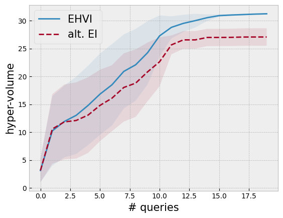

```python
import warnings

import botorch
import gpytorch
import matplotlib.pyplot as plt
import numpy as np
import torch
from matplotlib.figure import figaspect
from tqdm.notebook import tqdm

torch.manual_seed(0)

plt.style.use("bmh")
plt.rc("figure", figsize=figaspect(3 / 4))
```


```python
from botorch.acquisition.analytic import LogExpectedImprovement
from botorch.acquisition.multi_objective.analytic import ExpectedHypervolumeImprovement
from botorch.models.model_list_gp_regression import ModelListGP
from botorch.optim.optimize import optimize_acqf
from botorch.utils.multi_objective.box_decompositions.dominated import (
    DominatedPartitioning,
)
from botorch.utils.multi_objective.box_decompositions.non_dominated import (
    FastNondominatedPartitioning,
)
from botorch.utils.multi_objective.pareto import is_non_dominated
```


```python
def objective1(x):
    # a modification of https://www.sfu.ca/~ssurjano/forretal08.html
    y = -((x + 1) ** 2) * torch.sin(2 * x + 2) / 5 + 1 + x / 20
    return y


def objective2(x):
    return (0.1 * objective1(x) + objective1(x - 4)) / 3 - x / 3 + 0.5


def joint_objective(x):
    y1 = objective1(x)
    y2 = objective2(x)

    return torch.vstack([y1.flatten(), y2.flatten()]).transpose(-1, -2)


lb = -5
ub = 5

bounds = torch.tensor([[lb], [ub]], dtype=torch.float)

xs = torch.linspace(lb, ub, 201)
ys = joint_objective(xs)
ref_point = torch.tensor([ys[:, 0].min(), ys[:, 1].min()])
ref_point
```


    tensor([-2.0292, -0.4444])


```python
class GPModel(gpytorch.models.ExactGP, botorch.models.gpytorch.GPyTorchModel):
    _num_outputs = 1

    def __init__(self, train_x, train_y, likelihood):
        super().__init__(train_x, train_y, likelihood)
        self.mean_module = gpytorch.means.ConstantMean()
        self.covar_module = gpytorch.kernels.ScaleKernel(
            gpytorch.kernels.MaternKernel(nu=2.5, ard_num_dims=1)
        )

    def forward(self, x):
        mean_x = self.mean_module(x)
        covar_x = self.covar_module(x)
        return gpytorch.distributions.MultivariateNormal(mean_x, covar_x)


def fit_gp_model(train_x, train_y, num_train_iters=500):
    # Declare the GP.
    noise = 1e-4

    likelihood = gpytorch.likelihoods.GaussianLikelihood()
    model = GPModel(train_x, train_y, likelihood)
    model.likelihood.noise = noise

    # Train the hyperparameter (the constant).
    optimizer = torch.optim.Adam(model.parameters(), lr=0.01)
    mll = gpytorch.mlls.ExactMarginalLogLikelihood(likelihood, model)

    model.train()
    likelihood.train()

    for i in range(num_train_iters):
        optimizer.zero_grad()

        output = model(train_x)
        loss = -mll(output, train_y)

        loss.backward()
        optimizer.step()

    model.eval()
    likelihood.eval()

    return model, likelihood
```


```python
num_queries = 20
num_repeats = 10
```


```python
strategy = "ehvi"  # "alt_ei", "ehvi"
strategy = strategy.upper()

hypervolumes = torch.zeros((num_repeats, num_queries))

for trial in range(num_repeats):
    print("trial", trial)

    torch.manual_seed(trial)
    train_x = bounds[0] + (bounds[1] - bounds[0]) * torch.rand(1, 1)
    train_y = joint_objective(train_x)

    for i in tqdm(range(num_queries)):
        dominated_part = DominatedPartitioning(ref_point, train_y)
        hypervolumes[trial, i] = dominated_part.compute_hypervolume().item()

        model1, likelihood = fit_gp_model(train_x, train_y[:, 0])
        model2, likelihood = fit_gp_model(train_x, train_y[:, 1])

        if strategy == "ALT_EI":
            if i % 2 == 0:
                model = model1
                best_f = train_y[:, 0].max()
            else:
                model = model2
                best_f = train_y[:, 1].max()

            policy = LogExpectedImprovement(model=model, best_f=best_f)

        if strategy == "EHVI":
            with warnings.catch_warnings():
                warnings.simplefilter("ignore")

                policy = ExpectedHypervolumeImprovement(
                    model=ModelListGP(model1, model2),
                    ref_point=ref_point,
                    partitioning=FastNondominatedPartitioning(ref_point, train_y),
                )

        with warnings.catch_warnings():
            warnings.filterwarnings("ignore", category=RuntimeWarning)
            next_x, acq_val = optimize_acqf(
                policy, bounds=bounds, q=1, num_restarts=20, raw_samples=50
            )

        next_y = joint_objective(next_x)

        train_x = torch.cat([train_x, next_x])
        train_y = torch.cat([train_y, next_y])
```

    trial 0


      0%|          | 0/20 [00:00<?, ?it/s]


    trial 1


      0%|          | 0/20 [00:00<?, ?it/s]


    trial 2


      0%|          | 0/20 [00:00<?, ?it/s]


    trial 3


      0%|          | 0/20 [00:00<?, ?it/s]


    trial 4


      0%|          | 0/20 [00:00<?, ?it/s]


    trial 5


      0%|          | 0/20 [00:00<?, ?it/s]


    trial 6


      0%|          | 0/20 [00:00<?, ?it/s]


    trial 7


      0%|          | 0/20 [00:00<?, ?it/s]


    trial 8


      0%|          | 0/20 [00:00<?, ?it/s]


    trial 9


      0%|          | 0/20 [00:00<?, ?it/s]


```python
torch.save(hypervolumes, f"./forrester/{strategy}.pth")
```


```python
def show_agg_progress(path, name, linestyle="solid"):
    def ci(y):
        return 2 * y.std(axis=0) / np.sqrt(num_repeats)

    incumbents = torch.load(path)
    avg_incumbent = incumbents.mean(axis=0)
    ci_incumbent = ci(incumbents)

    plt.plot(avg_incumbent, linestyle=linestyle, label=name)
    plt.fill_between(
        np.arange(num_queries),
        avg_incumbent + ci_incumbent,
        avg_incumbent - ci_incumbent,
        alpha=0.1,
    )


show_agg_progress(
    "./forrester/EHVI.pth",
    "EHVI",
)
show_agg_progress("./forrester/ALT_EI.pth", "alt. EI", linestyle="--")

plt.xlabel("# queries", fontsize=15)
plt.ylabel("hyper-volume", fontsize=15)

plt.legend(fontsize=15);
```


    

    


```python
torch.save(train_x, "./forrester/train_x.pth")
torch.save(train_y, "./forrester/train_y.pth")
```
