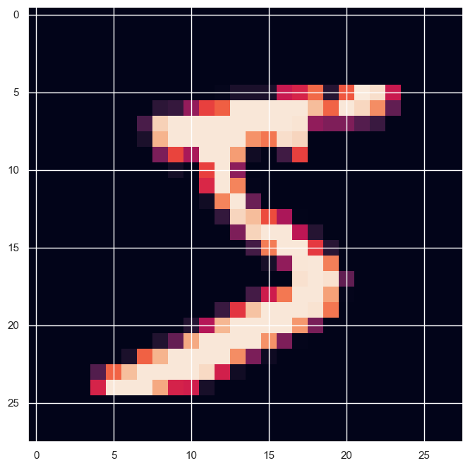
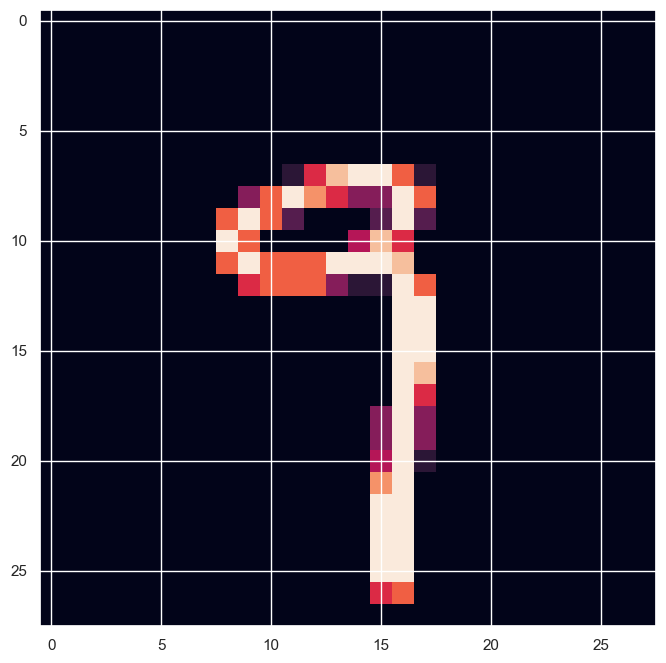
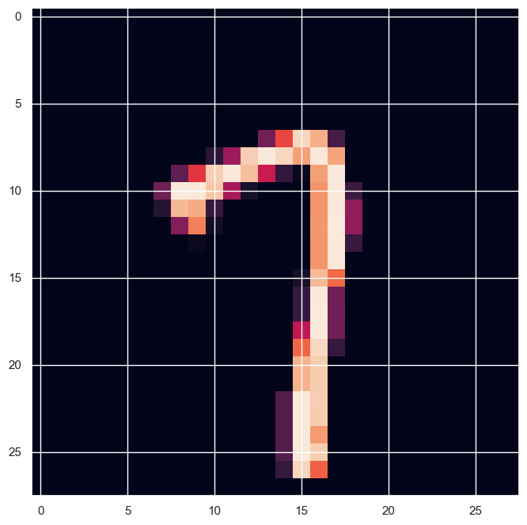
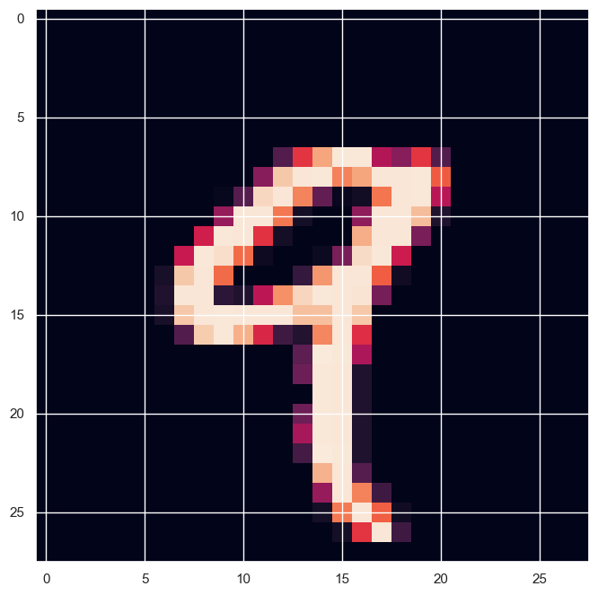
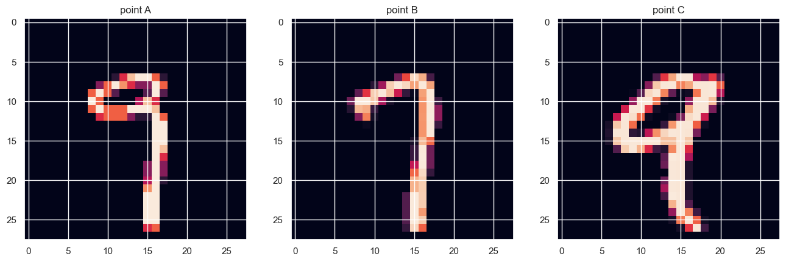

```python
import gpytorch
import matplotlib.pyplot as plt
import torch
from torchvision import datasets, transforms

plt.style.use("bmh")
plt.rcParams["image.cmap"] = "Blues_r"

import seaborn as sns

sns.set()
```

## Numbers


```python
rbf_kernel = gpytorch.kernels.RBFKernel()
```


```python
rbf_kernel(torch.tensor([0.0]), torch.tensor([0.1])).evaluate().item()
```


    0.9896470904350281


```python
rbf_kernel(torch.tensor([0.0]), torch.tensor([10.0])).evaluate().item()
```


    0.0


## Images


```python
rbf_kernel = gpytorch.kernels.RBFKernel()
rbf_kernel.lengthscale = 100
```


```python
transform = transforms.Compose(
    [transforms.ToTensor(), transforms.Normalize((0.1307,), (0.3081,))]
)

dataset = datasets.MNIST("../data", train=True, download=True, transform=transform)

train_x = dataset.data.view(-1, 28 * 28)
```


```python
train_x[0, :]
```


    tensor([  0,   0,   0,   0,   0,   0,   0,   0,   0,   0,   0,   0,   0,   0,
              0,   0,   0,   0,   0,   0,   0,   0,   0,   0,   0,   0,   0,   0,
              0,   0,   0,   0,   0,   0,   0,   0,   0,   0,   0,   0,   0,   0,
              0,   0,   0,   0,   0,   0,   0,   0,   0,   0,   0,   0,   0,   0,
              0,   0,   0,   0,   0,   0,   0,   0,   0,   0,   0,   0,   0,   0,
              0,   0,   0,   0,   0,   0,   0,   0,   0,   0,   0,   0,   0,   0,
              0,   0,   0,   0,   0,   0,   0,   0,   0,   0,   0,   0,   0,   0,
              0,   0,   0,   0,   0,   0,   0,   0,   0,   0,   0,   0,   0,   0,
              0,   0,   0,   0,   0,   0,   0,   0,   0,   0,   0,   0,   0,   0,
              0,   0,   0,   0,   0,   0,   0,   0,   0,   0,   0,   0,   0,   0,
              0,   0,   0,   0,   0,   0,   0,   0,   0,   0,   0,   0,   3,  18,
             18,  18, 126, 136, 175,  26, 166, 255, 247, 127,   0,   0,   0,   0,
              0,   0,   0,   0,   0,   0,   0,   0,  30,  36,  94, 154, 170, 253,
            253, 253, 253, 253, 225, 172, 253, 242, 195,  64,   0,   0,   0,   0,
              0,   0,   0,   0,   0,   0,   0,  49, 238, 253, 253, 253, 253, 253,
            253, 253, 253, 251,  93,  82,  82,  56,  39,   0,   0,   0,   0,   0,
              0,   0,   0,   0,   0,   0,   0,  18, 219, 253, 253, 253, 253, 253,
            198, 182, 247, 241,   0,   0,   0,   0,   0,   0,   0,   0,   0,   0,
              0,   0,   0,   0,   0,   0,   0,   0,  80, 156, 107, 253, 253, 205,
             11,   0,  43, 154,   0,   0,   0,   0,   0,   0,   0,   0,   0,   0,
              0,   0,   0,   0,   0,   0,   0,   0,   0,  14,   1, 154, 253,  90,
              0,   0,   0,   0,   0,   0,   0,   0,   0,   0,   0,   0,   0,   0,
              0,   0,   0,   0,   0,   0,   0,   0,   0,   0,   0, 139, 253, 190,
              2,   0,   0,   0,   0,   0,   0,   0,   0,   0,   0,   0,   0,   0,
              0,   0,   0,   0,   0,   0,   0,   0,   0,   0,   0,  11, 190, 253,
             70,   0,   0,   0,   0,   0,   0,   0,   0,   0,   0,   0,   0,   0,
              0,   0,   0,   0,   0,   0,   0,   0,   0,   0,   0,   0,  35, 241,
            225, 160, 108,   1,   0,   0,   0,   0,   0,   0,   0,   0,   0,   0,
              0,   0,   0,   0,   0,   0,   0,   0,   0,   0,   0,   0,   0,  81,
            240, 253, 253, 119,  25,   0,   0,   0,   0,   0,   0,   0,   0,   0,
              0,   0,   0,   0,   0,   0,   0,   0,   0,   0,   0,   0,   0,   0,
             45, 186, 253, 253, 150,  27,   0,   0,   0,   0,   0,   0,   0,   0,
              0,   0,   0,   0,   0,   0,   0,   0,   0,   0,   0,   0,   0,   0,
              0,  16,  93, 252, 253, 187,   0,   0,   0,   0,   0,   0,   0,   0,
              0,   0,   0,   0,   0,   0,   0,   0,   0,   0,   0,   0,   0,   0,
              0,   0,   0, 249, 253, 249,  64,   0,   0,   0,   0,   0,   0,   0,
              0,   0,   0,   0,   0,   0,   0,   0,   0,   0,   0,   0,   0,   0,
             46, 130, 183, 253, 253, 207,   2,   0,   0,   0,   0,   0,   0,   0,
              0,   0,   0,   0,   0,   0,   0,   0,   0,   0,   0,   0,  39, 148,
            229, 253, 253, 253, 250, 182,   0,   0,   0,   0,   0,   0,   0,   0,
              0,   0,   0,   0,   0,   0,   0,   0,   0,   0,  24, 114, 221, 253,
            253, 253, 253, 201,  78,   0,   0,   0,   0,   0,   0,   0,   0,   0,
              0,   0,   0,   0,   0,   0,   0,   0,  23,  66, 213, 253, 253, 253,
            253, 198,  81,   2,   0,   0,   0,   0,   0,   0,   0,   0,   0,   0,
              0,   0,   0,   0,   0,   0,  18, 171, 219, 253, 253, 253, 253, 195,
             80,   9,   0,   0,   0,   0,   0,   0,   0,   0,   0,   0,   0,   0,
              0,   0,   0,   0,  55, 172, 226, 253, 253, 253, 253, 244, 133,  11,
              0,   0,   0,   0,   0,   0,   0,   0,   0,   0,   0,   0,   0,   0,
              0,   0,   0,   0, 136, 253, 253, 253, 212, 135, 132,  16,   0,   0,
              0,   0,   0,   0,   0,   0,   0,   0,   0,   0,   0,   0,   0,   0,
              0,   0,   0,   0,   0,   0,   0,   0,   0,   0,   0,   0,   0,   0,
              0,   0,   0,   0,   0,   0,   0,   0,   0,   0,   0,   0,   0,   0,
              0,   0,   0,   0,   0,   0,   0,   0,   0,   0,   0,   0,   0,   0,
              0,   0,   0,   0,   0,   0,   0,   0,   0,   0,   0,   0,   0,   0,
              0,   0,   0,   0,   0,   0,   0,   0,   0,   0,   0,   0,   0,   0,
              0,   0,   0,   0,   0,   0,   0,   0,   0,   0,   0,   0,   0,   0],
           dtype=torch.uint8)


```python
plt.figure(figsize=(8, 8))

plt.imshow(train_x[0, :].view(28, 28));
```


    

    


```python
ind1 = 304
ind2 = 786
ind3 = 4

rbf_kernel(train_x[[ind1, ind2, ind3], :]).evaluate()
```


    tensor([[1.0000e+00, 4.9937e-25, 0.0000e+00],
            [4.9937e-25, 1.0000e+00, 0.0000e+00],
            [0.0000e+00, 0.0000e+00, 1.0000e+00]], grad_fn=<RBFCovarianceBackward>)


```python
for ind in [ind1, ind2, ind3]:
    plt.figure(figsize=(8, 8))

    plt.imshow(train_x[ind, :].view(28, 28));
```


    

    


    

    


    

    


```python
fig, ax = plt.subplots(1, 3, figsize=(16, 5))

ax[0].imshow(train_x[ind1, :].view(28, 28))
ax[0].set_title("point A")

ax[1].imshow(train_x[ind2, :].view(28, 28))
ax[1].set_title("point B")

ax[2].imshow(train_x[ind3, :].view(28, 28))
ax[2].set_title("point C")

plt.show()
```


    

    

