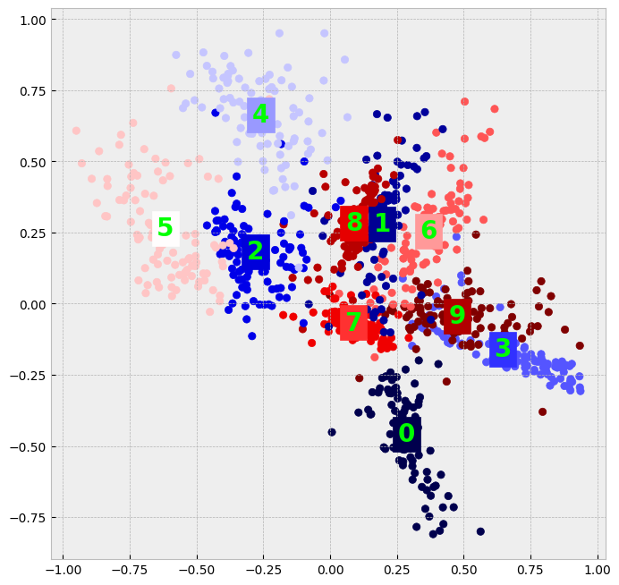
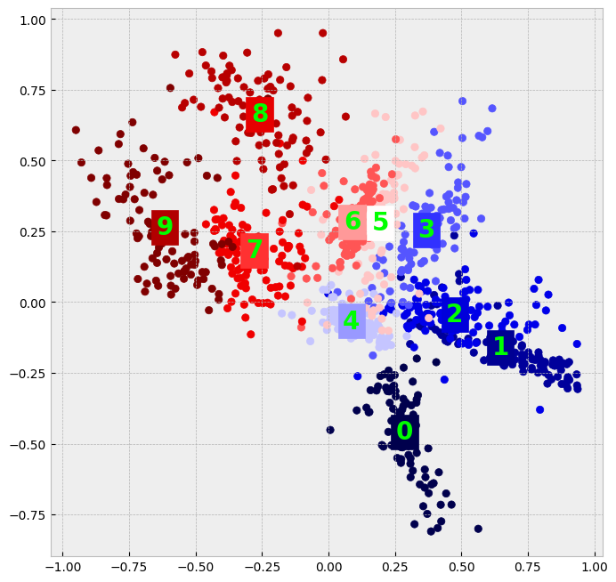

```python
import torch

torch.manual_seed(0)

import gpytorch
import matplotlib.pyplot as plt
from torchvision import datasets, transforms

plt.style.use("bmh")
plt.rcParams["image.cmap"] = "Blues_r"

from tqdm.notebook import tqdm
```


```python
transform = transforms.Compose(
    [transforms.ToTensor(), transforms.Normalize((0.1307,), (0.3081,))]
)

dataset1 = datasets.MNIST("../data", train=True, download=True, transform=transform)
dataset2 = datasets.MNIST("../data", train=False, download=True, transform=transform)

train_x = dataset1.data[:1000, ...].view(1000, -1).to(torch.float)
train_y = dataset1.targets[:1000]

test_x = dataset2.data[:500, ...].view(500, -1).to(torch.float)
test_y = dataset2.targets[:500]
```


```python
class GPModel(gpytorch.models.ExactGP):
    def __init__(self, train_x, train_y, likelihood):
        super().__init__(train_x, train_y, likelihood)
        self.mean_module = gpytorch.means.ConstantMean()
        self.covar_module = gpytorch.kernels.ScaleKernel(gpytorch.kernels.RBFKernel())

    def forward(self, x):
        mean_x = self.mean_module(x)
        covar_x = self.covar_module(x)
        return gpytorch.distributions.MultivariateNormal(mean_x, covar_x)
```


```python
# declare the GP
likelihood = gpytorch.likelihoods.GaussianLikelihood()
model = GPModel(train_x, train_y, likelihood)

# train the hyperparameter
optimizer = torch.optim.Adam(model.parameters(), lr=0.01)
mll = gpytorch.mlls.ExactMarginalLogLikelihood(likelihood, model)

model.train()
likelihood.train()

losses = []
lengthscales = []
outputscales = []
for i in tqdm(range(500)):
    optimizer.zero_grad()

    output = model(train_x)
    loss = -mll(output, train_y)

    loss.backward()

    losses.append(loss.item())
    lengthscales.append(model.covar_module.base_kernel.lengthscale.item())
    outputscales.append(model.covar_module.outputscale.item())

    optimizer.step()

model.eval()
likelihood.eval()
```


      0%|          | 0/500 [00:00<?, ?it/s]


    GaussianLikelihood(
      (noise_covar): HomoskedasticNoise(
        (raw_noise_constraint): GreaterThan(1.000E-04)
      )
    )


```python
with torch.no_grad():
    mean_preds = model(test_x).mean

print(f"mean absolute error: {torch.mean(torch.abs(mean_preds - test_y))}")
```

    mean absolute error: 2.7021291255950928


```python
data_dim = train_x.size(-1)


class LargeFeatureExtractor(torch.nn.Sequential):
    def __init__(self, datea_dim):
        super(LargeFeatureExtractor, self).__init__()
        self.add_module("linear1", torch.nn.Linear(data_dim, 1000))
        self.add_module("relu1", torch.nn.ReLU())
        self.add_module("linear2", torch.nn.Linear(1000, 500))
        self.add_module("relu2", torch.nn.ReLU())
        self.add_module("linear3", torch.nn.Linear(500, 50))
        self.add_module("relu3", torch.nn.ReLU())
        self.add_module("linear4", torch.nn.Linear(50, 2))


feature_extractor = LargeFeatureExtractor(data_dim)
```


```python
class GPRegressionModel(gpytorch.models.ExactGP):
    def __init__(self, train_x, train_y, likelihood):
        super(GPRegressionModel, self).__init__(train_x, train_y, likelihood)
        self.mean_module = gpytorch.means.ConstantMean()
        self.covar_module = gpytorch.kernels.GridInterpolationKernel(
            gpytorch.kernels.ScaleKernel(gpytorch.kernels.RBFKernel(ard_num_dims=2)),
            num_dims=2,
            grid_size=100,
        )
        self.feature_extractor = feature_extractor

        self.scale_to_bounds = gpytorch.utils.grid.ScaleToBounds(-1.0, 1.0)

    def forward(self, x):
        projected_x = self.feature_extractor(x)
        projected_x = self.scale_to_bounds(projected_x)

        mean_x = self.mean_module(projected_x)
        covar_x = self.covar_module(projected_x)
        return gpytorch.distributions.MultivariateNormal(mean_x, covar_x)
```


```python
likelihood = gpytorch.likelihoods.GaussianLikelihood()
model = GPRegressionModel(train_x, train_y, likelihood)
```


```python
optimizer = torch.optim.Adam(
    [
        {"params": model.feature_extractor.parameters()},
        {"params": model.covar_module.parameters()},
        {"params": model.mean_module.parameters()},
        {"params": model.likelihood.parameters()},
    ],
    lr=0.01,
)

mll = gpytorch.mlls.ExactMarginalLogLikelihood(likelihood, model)

model.train()
likelihood.train()

for i in tqdm(range(500)):
    optimizer.zero_grad()

    output = model(train_x)
    loss = -mll(output, train_y)

    loss.backward()
    optimizer.step()

model.eval()
likelihood.eval()
```


      0%|          | 0/500 [00:00<?, ?it/s]


    /Users/alextanhongpin/Library/Caches/pypoetry/virtualenvs/python-bayesian-optimization-in-action-aU6qUxK9-py3.12/lib/python3.12/site-packages/linear_operator/utils/sparse.py:51: UserWarning: TypedStorage is deprecated. It will be removed in the future and UntypedStorage will be the only storage class. This should only matter to you if you are using storages directly.  To access UntypedStorage directly, use tensor.untyped_storage() instead of tensor.storage()
      if nonzero_indices.storage():
    /Users/alextanhongpin/Library/Caches/pypoetry/virtualenvs/python-bayesian-optimization-in-action-aU6qUxK9-py3.12/lib/python3.12/site-packages/linear_operator/utils/sparse.py:66: UserWarning: torch.sparse.SparseTensor(indices, values, shape, *, device=) is deprecated.  Please use torch.sparse_coo_tensor(indices, values, shape, dtype=, device=). (Triggered internally at /Users/runner/work/pytorch/pytorch/pytorch/torch/csrc/utils/tensor_new.cpp:646.)
      res = cls(index_tensor, value_tensor, interp_size)


    GaussianLikelihood(
      (noise_covar): HomoskedasticNoise(
        (raw_noise_constraint): GreaterThan(1.000E-04)
      )
    )


```python
with torch.no_grad():
    extracted_features = model.feature_extractor(train_x)
    extracted_features = model.scale_to_bounds(extracted_features)
```


```python
random_map = {
    0: 0,
    1: 3,
    2: 9,
    3: 6,
    4: 7,
    5: 1,
    6: 8,
    7: 2,
    8: 4,
    9: 5,
}

plt.figure(figsize=(8, 8))

for label in range(10):
    mask = train_y == label

    plt.scatter(
        extracted_features[mask, 0],
        extracted_features[mask, 1],
        c=torch.ones_like(train_y[mask]) * random_map[label],
        vmin=0,
        vmax=9,
        label=random_map[label],
        cmap="seismic",
    )

    plt.annotate(
        random_map[label],
        (extracted_features[mask, 0].mean(), extracted_features[mask, 1].mean()),
        horizontalalignment="center",
        verticalalignment="center",
        size=20,
        weight="bold",
        color="lime",
        backgroundcolor=plt.cm.seismic(random_map[label] * 0.1),
    )

# plt.legend()
plt.show()
```


    

    


```python
plt.figure(figsize=(8, 8))

for label in range(10):
    mask = train_y == label

    plt.scatter(
        extracted_features[mask, 0],
        extracted_features[mask, 1],
        c=train_y[mask],
        vmin=0,
        vmax=9,
        label=label,
        cmap="seismic",
    )

    plt.annotate(
        label,
        (extracted_features[mask, 0].mean(), extracted_features[mask, 1].mean()),
        horizontalalignment="center",
        verticalalignment="center",
        size=20,
        weight="bold",
        color="lime",
        backgroundcolor=plt.cm.seismic(label * 0.1),
    )

# plt.legend()
plt.show()
```


    

    


```python
with torch.no_grad():
    mean_preds = model(test_x).mean

print(f"mean absolute error: {torch.mean(torch.abs(mean_preds - test_y))}")
```
